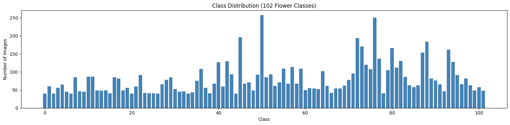
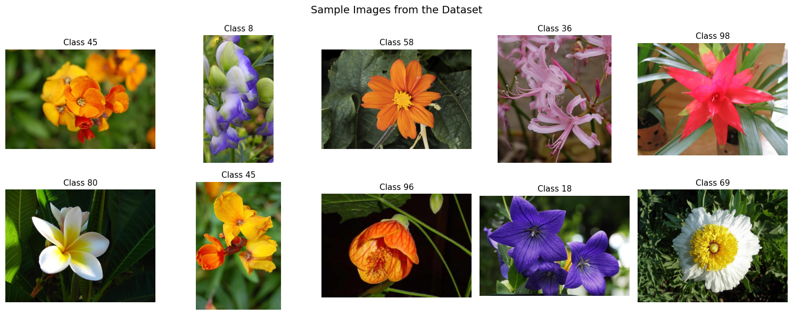
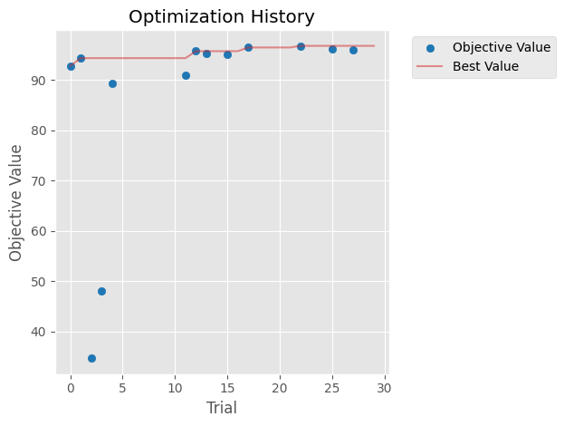
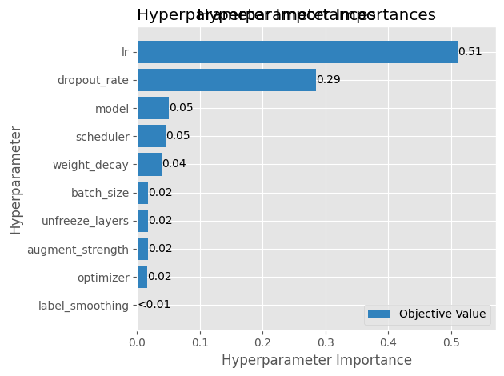
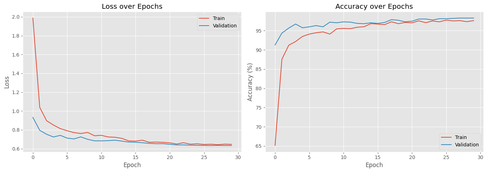
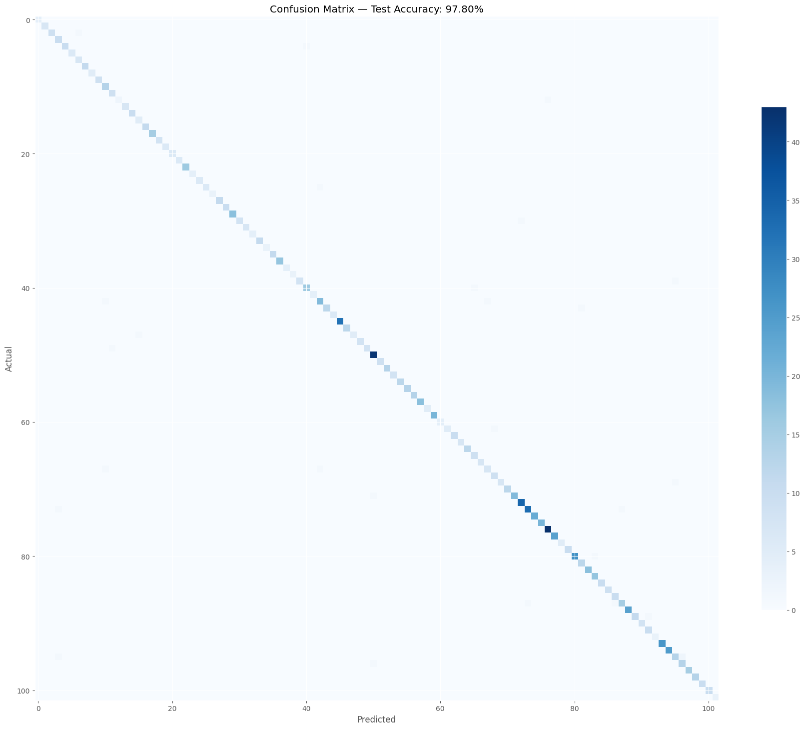
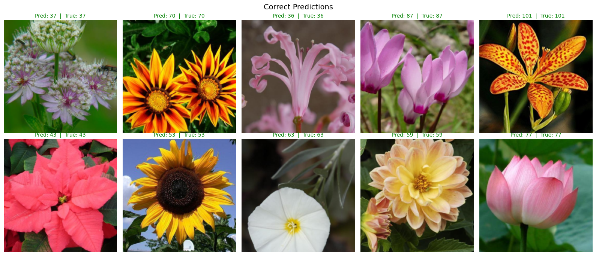

# FloraVision

An end-to-end flower classification system that identifies 102 flower species with **97.80% test accuracy**. Built with PyTorch, optimized with Optuna, and deployed as a live web app.

**[Try the Live Demo](https://huggingface.co/spaces/welyty/FloraVision)**

---

## Overview

FloraVision classifies flower images into 102 species from the [Oxford 102 Flowers](https://www.robots.ox.ac.uk/~vgg/data/flowers/102/) dataset. The project covers the full ML pipeline: data exploration, automated model selection, hyperparameter optimization, training with early stopping, evaluation, and web deployment.

## Dataset

The Oxford 102 Flowers dataset contains **8,189 images** across **102 flower species** commonly found in the United Kingdom. The class distribution is imbalanced, ranging from 40 to 258 images per class.





## Approach

### Architecture Search with Optuna

Rather than manually picking a model, I used **Optuna** to search across **4 pretrained architectures** and **12 hyperparameters** over **30 trials with pruning**:

**Architectures searched:**
- ResNet18
- EfficientNet-B0
- DenseNet121
- ConvNeXt-Tiny

**Hyperparameters optimized:**
- Model architecture, learning rate, weight decay, dropout rate, optimizer (Adam/SGD), scheduler (cosine/step/plateau), batch size, augmentation strength, label smoothing, number of unfrozen layers



### Key Finding: Learning Rate Matters Most

The hyperparameter importance analysis revealed that **learning rate** (0.51) and **dropout rate** (0.29) dominated performance — architecture choice only accounted for 0.05 of the variance.



### Best Configuration

| Parameter | Value |
|-----------|-------|
| Model | ConvNeXt-Tiny |
| Optimizer | Adam |
| Learning Rate | 0.001921 |
| Weight Decay | 0.000045 |
| Scheduler | Cosine Annealing |
| Dropout | 0.4059 |
| Augmentation | Medium |
| Label Smoothing | 0.0502 |
| Batch Size | 16 |
| Unfrozen Layers | 0 |

## Training

The best model was trained for **30 epochs** with early stopping and cosine annealing scheduler. Training and validation curves show clean convergence with minimal overfitting.



## Results

**Test Accuracy: 97.80%** on a held-out test set (15% of data, never seen during training or hyperparameter search).



The confusion matrix shows a near-perfect diagonal with very few misclassifications, concentrated among visually similar flower species.



## Project Structure

```
FloraVision/
├── README.md
├── notebook/
│   └── flower_classifier.ipynb    # Full training pipeline
├── app/
│   ├── app.py                     # Flask web app
│   ├── class_names.json           # 102 flower name mappings
│   ├── requirements.txt           # App dependencies
│   └── templates/
│       └── index.html             # Frontend UI
└── images/                        # Training visualizations
```

## Tech Stack

- **PyTorch** — model training and transfer learning
- **Optuna** — hyperparameter optimization with pruning
- **torchvision** — pretrained models and data augmentation
- **Flask** — web interface
- **HuggingFace Spaces** — deployment

## How to Run

### Training (Google Colab)
Open `notebook/flower_classifier.ipynb` in Google Colab with a GPU runtime. The notebook downloads the dataset automatically and runs the full pipeline.

### Web App (Local)
```bash
cd app
pip install -r requirements.txt
python app.py
```

> The model weights (`best_flower_model.pth`, ~106 MB) are hosted on [Hugging Face](https://huggingface.co/spaces/welyty/FloraVision/resolve/main/best_flower_model.pth) and are not included in this repo. Download and place in `app/` before running.

### Live Demo
Visit **[huggingface.co/spaces/welyty/FloraVision](https://huggingface.co/spaces/welyty/FloraVision)** to try the classifier directly in your browser.
